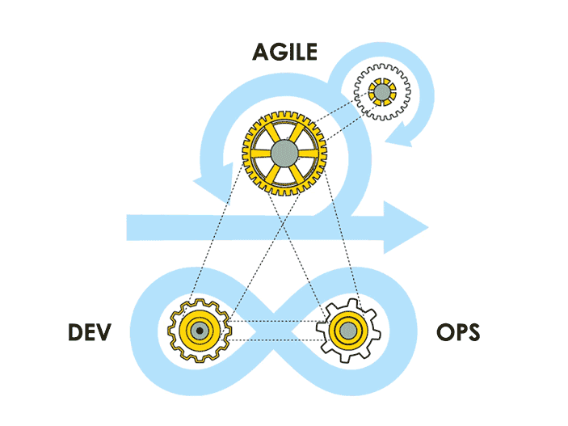

 

<!-- 

<!--
**muhammet/muhammetguzel* is a ✨ _special_ ✨ repository because its `README.md` (this file) appears on your GitHub profile.

Here are some ideas to get you started:

- 🔭 I’m currently working on ...

- 👯 I’m looking to collaborate on ...
- 🤔 I’m looking for help with ...
- 💬 Ask me about ...

- 😄 Pronouns: ...
- ⚡ Fun fact: ...
-->
 

### Hi there 👋

- 🆠I love technology and like to help others with any knowledge that I have  
- ✨ Please Feel Free to Reach Out if You Have Any Questions or Suggestions
- You can show some   ❤️    &nbsp; by starring some of the repositories 😄 
- ✨ Enthusiastic DevOps eager to contribute to team success through hard work, 
- Attention to detail and excellent organizational skills. 
- ✨ Believes in the importance of learning new things every day. 
- A lifelong learner. 
- ✨ Motivated to learn, grow and excel in IT industry.
- 📫 How to reach me: muhammetguzell@gmail.com

<h2>🏆 Github Profile Trophy</h2>

